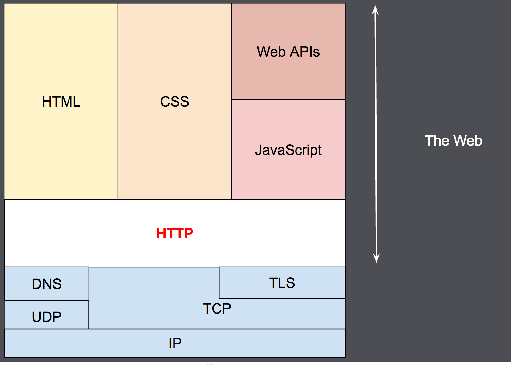

# #1 HTTP 의 이해

### HTTP

HTTP란 "HyperText Transfer Protocol"의 약자로, HTML 문서와 같은 리소스를 전송하기 위한 프로토콜이다.&#x20;

**특징**

* HTTP는 클라이언트가 요청(Request)를 하기 위해 연결을 연 다음, 응답(Response)을 받을때 까지 대기하는 전통적인 "**클라이언트 - 서버 모델**"을 따른다.
* HTTP는 **Stateless**이기때문에, 서버가 서로 다른 요청 간 **어떠한 상태도 유지하지 않는다.**

<figure><figcaption>
HTTP는 OSI 7 Layer 중 "애플리케이션 계층에 속한다. (출처 : MDN)
</figcaption></figure>

**Client - Server model**

클라이언트의 각각 개별적인 요청은 서버로 전송되고, 서버는 요청을 처리하고 응답을 제공한다. 이러한 네트워크 아키텍처를 "클라이언트 - 서버" 모델 또는 아키텍처라고 한다.

<figure><figcaption>
요청과 응답 사이에는 클라이언트와 서버 외에도 Proxy, Cache 등이 있다.
</figcaption></figure>

**Idempotent**

같은 요청을 여러번 서버로 전송하더라도, 기존 목적과 동일하게 동작하는것을 의미한다. 일반적으로 HTTP Method로 대표되는 GET, POST, PUT, DELETE 4개의 메서드 중 POST는 멱등하지 않은데, POST의 경우 클라이언트의 요청으로 인해 서버에서의 변경이 일어나기 때문이다.

멱등성은 왜 구분할까? 네트워크에서 어떤 요청이 발생했을 때, 다양한 원인으로 인해 이 요청이 실패할 가능성은 언제든지 존재한다. 이런 상황들은 일반적으로 재시도를 시도하게 되는데 재시도 이전 요청에 대한 처리가 요구되기 때문이다.

**Stateless vs Stateful**

위에서 설명했듯이 HTTP의 특징 중 하나는 Stateless인데, 클라이언트와 서버간의 관계에서 "클라이언트의 상태를 보존"한다는 의미이다. 이 뜻은 "서로 다른 요청 간" 즉, 이전 요청이 서버에 전달되었던 것이 그 다음 요청과는 어떠한 관계가 이어지지 않음을 뜻한다.

**Cookie vs Session**

쿠키는 서버가 사용자의 웹 브라우저에 전송하는 작은 데이터 조각으로, 브라우저는 그 데이터 조각들을 저장해 놓았다가, 동일한 서버에 재 요청 시 저장된 데이터를 함께 전송한다. 이 때, 전송된 쿠리를 통해 이전 요청과 현재의 요청이 동일한 브라우저로부터의 요청인지 아닌지를 판단하는 기준으로 사용된다.

쿠키를 사용하는 이유는 쿠키를 활용하면 Stateless의 특징을 가진 HTTP 프로토콜에서 상태정보를 기억할 수 있도록 활용할 수 있게 된다. 사용자의 로그인 상태를 유지가 되는 예를들수 있다.

세션은 쿠키를 기반으로하여 그 기능과 원리도 비슷하다. 하지만 몇가지 차이점이 있는데 다음과 같다.

1. 쿠키는 저장되는 위치가 "**브라우저**"인 반면 세션은 "**서버**"에서 관리된다.&#x20;
2. 따라서 세션은 서버의 자원을 사용한다. (쿠키는 서버 자원을 사용하지 않음)
3. 세션은 서버의 처리가 필요하므로, 쿠키에 비해 속도는 느리다
4. 보안측면에서 보면 세션이 쿠키보다 낫다.
5. 쿠키의 경우 로컬에 남기때문에, 브라우저를 종료해도 데이터가 남을 수 있다. 만료시간이 길게 설정된 경우, 쿠키 삭제 전까지 유지된다.
6. 세션의 경우, 브라우저가 종료되면 만료시간과 관계없이 삭제된다.

**HTTP vs HTTPS**

HTTP는 암호화되지 않은 데이터를 전송한다. 즉, 브라우저에서 전송된 정보를 제3자가 가로채고 읽을 수 있는데, 이런 네트워크 통신 상 보안 계층을 추가하기위해 HTTP Request / Response에 SSL/TLS 인증서를 결합한 확장된 프로토콜이다.

<figure><figcaption>
<a href="https://aws.amazon.com/ko/compare/the-difference-between-https-and-http/">https://aws.amazon.com/ko/compare/the-difference-between-https-and-http/</a>
</figcaption></figure>

