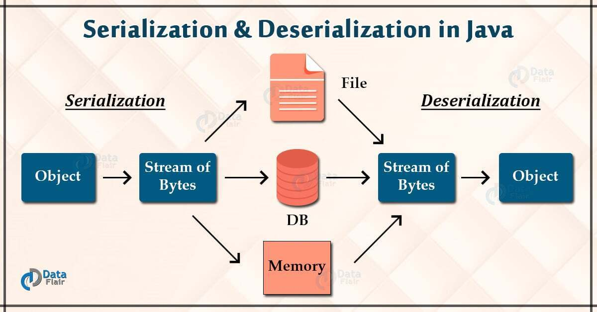

# #5 Serialization

**Serialization**

객체를 그 자체로 저장하거나 네트워크로 전송할수 없기 때문에, 데이터의 구조나 오브젝트 상태를 저장/전송가능하며 재구성할 수 있는 포맷으로 변환하는 과정을 말한다.

<figure><figcaption></figcaption></figure>

* [https://techblog.woowahan.com/2550/](https://techblog.woowahan.com/2550/)

**Marshaling**

마샬링은 직렬화와 거의 비슷한데 다른점은 **코드베이스**를 포함하여 **객체를 직렬화 한다. 코드베이스는** 객체를 받는이에게 이 객체의 구현을 어디서 찾을 수 있는지에 관한 정보를 말한다. 만약 다른 프로그램에게 객체를 전달했는데 이 객체를 다시 사용하려면 데이터 타입에 관한 정보가 있어야 한다. 코드베이스는 이 데이터가 어디에 있는지 알려주는 정보를 말한다.

**ObjectMapper**

JSON 형식을 사용할 때, 응답들을 직렬화하고 요청들을 역직렬화 할 때 사용하는 기술이다.

**JsonProperty**

JSON 데이터를 엔티티에 매핑시켜줄때, JSON Key와 필드이름이 동일하지 않은 경우 의도와 다른 동작을 하게된다. (ex. camel case -> snake case) 이럴 때 각 필드에 JSON Key와 필드를 매칭시켜주기위한 방법으로 JsonProperty 를 사용할 수 있다.

만약 필드가 매우 많아 각각 JsonProperty를 적용해야하는 상황에서 일괄적으로 적용할 때에는 JsonNaming을 어노테이션에 추가하여 사용할 수 있다.

